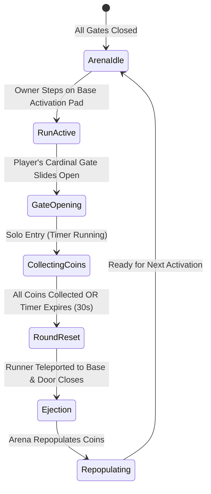

# Central Arena & Gate System Instructions

This document specifies the design, physical architecture, gate mechanics, coin spawning tiers, round clearance cycle, ejection routing, and dynamic unlock triggers for the **Central Arena** in the Coin Collector game.

For overarching game rules and requirements, refer to [INSTRUCTIONS.md](INSTRUCTIONS.md).  
For the 4-player compound and progression mechanics, refer to [BASE_INSTRUCTIONS.md](BASE_INSTRUCTIONS.md).

---

## 🏛️ Arena Architecture & Layout

The coin collection arena is located at the center of the world (`0, 0, 0`), surrounded by perimeter walls and 4 entrance gates aligned with the cardinal directions.

### Physical Dimensions
- **Arena Footprint**: $90 \times 90$ studs, centered at `(0, 0, 0)`.
- **Wall Height**: 26 studs high with smooth stone framing and dark slate panels.
- **Ceiling Enclosure**: Full-coverage invisible forcefield barrier (`CanCollide = true`, `Transparency = 1`) spanning $94 \times 94$ studs at $y = 26$ to $28$, preventing players from jumping over walls or entering the arena from above.
- **Corner Cornerstones**: $6 \times 6$ stud reinforced pillars at all 4 corners.
- **Gate Openings**: 4 openings (North, South, East, West), each 14 studs wide and 14 studs high.
- **Approach Highways**: 14-stud wide paved pathways extending outward from each gate directly connecting to the 4 player bases at 140 studs away.

---

## 🚪 Solo Arena Activation & Gate Control

The arena entrance is governed by 4 sliding gates managed by [src/ReplicatedStorage/GateController.lua](src/ReplicatedStorage/GateController.lua). Only **one gate opens at a time**, activated solely by a player standing in their own base:

### Gate Behavior & Solo Access Rules
- **Initial State**: All 4 gates start closed and locked with red indicators.
- **Solo Gate Activation**: A player steps on their base's **Arena Activation Pad** (`ArenaActivatePad`) to start their run.
- **Single Gate Opening**: **Only the gate leading to the activating player's base slides open** (green lights). All other 3 gates remain shut and locked (red lights).
- **Exclusive Entry Verification**: An invisible gate sensor strictly verifies player identity. If any other player attempts to enter the open gate, they are prevented from entering and teleported back to their own base spawn pad.
- **Intruder Ejection**: Any unauthorized players lingering inside the central arena enclosure when a run is initiated are immediately ejected to their respective bases or gate approach pathways.
- **Coin Expiration Countdown**: The player has `CoinExpirationTime` seconds (default: 30s) to enter and collect coins.
- **Gate Travel & Indicators**:
  - 🟢 **Neon Green**: Gate is **Open** for the activating base owner.
  - 🔴 **Neon Red**: Gate is **Closed / Locked** (default for idle and non-active gates).
  - 🟡 **Neon Yellow**: Gate is currently in transition (**Opening** or **Closing**).

---

## 🟡 Coin Spawning & Geometry

Coins inside the arena are managed via [src/ReplicatedStorage/Coin.lua](src/ReplicatedStorage/Coin.lua).

### Coin Geometry & Animation
- **Shape**: Cylinders spawned upright at chest/eye level ($y = 2.5$).
- **Aspect Ratio**: `Vector3.new(0.3, 2.5, 2.5)` (thin disc with a wide circular diameter).
- **Material**: Glowing `Neon` material with an embedded `PointLight` for vibrant illumination.
- **Dynamic Rotation**: Continuous yaw spin updated via `RunService.Heartbeat` at 120° per second.
- **Floating Bob**: Slight sinusoidal hover animation to improve visibility from a distance.

### Coin Tiers & Drop Tables
Coins randomly spawn across 3 tiers based on weighted roll tables defined in [src/ReplicatedStorage/CoinConfig.lua](src/ReplicatedStorage/CoinConfig.lua):

| Tier | Color | Base Value | Weight (Spawn Chance) | Description |
| :--- | :--- | :--- | :--- | :--- |
| **Standard** | Gold (`255, 200, 20`) | `1` | 60% (Weight: 60) | Common golden coin |
| **Silver** | Silver/White (`220, 225, 235`) | `3` | 30% (Weight: 30) | Uncommon silver coin |
| **Mega** | Cyan / Diamond (`0, 220, 255`) | `10` | 10% (Weight: 10) | Rare high-value treasure coin |

---

## 🔄 Round Clearance & Expiration Lifecycle

The arena run lifecycle is managed by [src/ServerScriptService/CoinCollector.server.lua](src/ServerScriptService/CoinCollector.server.lua):

### 1. Run Activation from Base
- A player who owns a base steps on the `ArenaActivatePad` inside their compound.
- The server checks if the arena is currently occupied (`activePlayer ~= nil`). If not, the run starts.
- All other base activation pads update to show `ARENA OCCUPIED [[PlayerName] Playing]`, and are disabled.
- The active runner's base activation pad updates to show `RUN IN PROGRESS [Arena Active]`.

### 2. Solo Gate Opening & Countdown
- Only the gate corresponding to the player's base cardinal direction slides open.
- The server starts a countdown for `CoinExpirationTime` seconds (default: 30s).
- Live attribute `ArenaTimeRemaining` ticks down on `ReplicatedStorage.CoinSettings`.

### 3. Run Termination Conditions
A run concludes when either:
1. **Coins Claimed**: The player collects all coins from the arena floor ($0$ coins remain).
2. **Timer Expired**: The 30-second expiration timer elapses before all coins could be collected.
3. **Player Disconnect**: The active player leaves the experience.

### 4. Player Ejection, Immediate Door Closure & Reset
- **Instant Player Ejection**: When the run ends (timer expired or coins cleared), the active runner is immediately teleported back to their home base spawn pad, and any remaining players inside the central arena enclosure are ejected to their home bases or nearest gate approach pathways.
- **Door Closes Immediately on Ejection**: As soon as the player is ejected, the open gate smoothly slides shut and locks (`CanCollide = true`, indicator red). A guaranteed completion fallback prevents the door from remaining open after the run.
- **Runner Base Activation Plate Deactivation**: The previous runner's base activation plate is **not left active or enabled**. It is immediately set to cooldown (`RunnerCooldown`, default: 10s) and disabled (`CanTouch = false`), displaying `COOLDOWN [Xs] [Other Players First]` in yellow.
- **Advantage for Other Players**: Other waiting players' activation plates are **immediately enabled** (green `⚡ START ARENA RUN ⚡`, `CanTouch = true`), giving other players the immediate opportunity to initialize the next coin collection run.
- **Manual Player Initialization**: The arena **never opens automatically**. All 4 gates remain closed until an eligible player steps on their base's `ArenaActivatePad` to initialize the next entry.
- Uncollected coins are cleared and the arena is repopulated with a fresh batch of coins (`MaxCoins`).
- The arena returns to `IdleReady`.

---

## ⚙️ Arena Live Configuration Attributes

These attributes are attached to the `ReplicatedStorage.CoinSettings` folder and can be modified live during gameplay in Roblox Studio:

| Attribute | Type | Default | Description |
| :--- | :--- | :--- | :--- |
| `ArenaStatus` | string | `"IdleReady"` | Status of the arena (`"IdleReady"`, `"ActiveRun"`, `"Locked"`) |
| `CoinExpirationTime` | number | `30` | Seconds a player has to claim coins before uncollected coins expire |
| `RunnerCooldown` | number | `10` | Cooldown (seconds) applied to previous runner before they can trigger arena again |
| `ArenaTimeRemaining` | number | `30` | Live countdown timer for the current active player's run |
| `ArenaActivePlayer` | string | `""` | Name of the player currently running the arena |
| `ArenaActiveBaseId` | number | `0` | Base ID currently controlling the arena (1-4) |
| `BatchRespawnOnly` | boolean | `true` | When true, arena waits for round completion before repopulating |
| `MaxCoins` | number | `30` | Maximum coins spawned per run |
| `Standard_Value` | number | `1` | Value awarded for Gold coins |
| `Standard_Weight` | number | `60` | Spawn weight for Gold coins |
| `Silver_Value` | number | `3` | Value awarded for Silver coins |
| `Silver_Weight` | number | `30` | Spawn weight for Silver coins |
| `Mega_Value` | number | `10` | Value awarded for Mega (Cyan) coins |
| `Mega_Weight` | number | `10` | Spawn weight for Mega coins |

---

## 🛠️ Modifying & Extending the Arena

- **Arena Enclosure Geometry**: To customize dimensions, highway widths, or wall visuals, see [src/ReplicatedStorage/ArenaEnclosure.lua](src/ReplicatedStorage/ArenaEnclosure.lua).
- **Gate Motion & Lighting**: To customize tween times, easing curves, or indicator lights, see [src/ReplicatedStorage/GateController.lua](src/ReplicatedStorage/GateController.lua).
- **Coin Visuals & Hitboxes**: To modify coin meshes, particles, or collection sounds, see [src/ReplicatedStorage/Coin.lua](src/ReplicatedStorage/Coin.lua).
