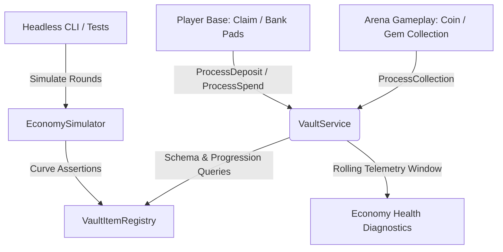

# Economy Architecture & Simulation Guidelines

This document specifies the decoupled economic system, mathematical progression curves, faucet/sink dynamics, item registry taxonomy, and automated telemetry simulation for the Arena Coin Battle game.

---

## 🏛️ Architecture & Decoupling Principles

The economy architecture is decoupled across three modular layers:



1. **Pure Configuration & Formulas**:
   The registry at [src/ReplicatedStorage/VaultItemRegistry.luau](src/ReplicatedStorage/VaultItemRegistry.luau#L1) holds item definitions, economic roles, progression weights, and pure calculation functions (`GetBaseUpgradeRequirement`, `CalculateBaseLevel`, `CalculateMultiplier`). It has zero engine side-effects and is runnable in any Luau environment.
2. **State & Transaction Authority**:
   The service at [src/ServerScriptService/VaultService.lua](src/ServerScriptService/VaultService.lua#L1) serves as the sole transaction manager. All leaderstats mutations, atomic deposits with mutex locking (`playerDepositLocks`), spends, and telemetry recordings execute through standard service pipelines (`ProcessCollection`, `ProcessDeposit`, `ProcessSpend`).
3. **Gameplay Orchestrators**:
   The coordinator at [src/ServerScriptService/CoinCollector.server.lua](src/ServerScriptService/CoinCollector.server.lua#L1) contains zero inline leveling formulas or hardcoded currency calculations. It queries `VaultService` during collection and banking events, ensuring game loop decoupling.

---

## 📦 Item Taxonomy & Schema

Every item in the economy is registered via `VaultItemRegistry.RegisterItem(itemDef)`. The schema enforces strict validation on both inventory and economic roles:

| Property | Type | Default | Description |
| :--- | :--- | :--- | :--- |
| `id` | `string` | *(Required)* | Unique identifier string (e.g. `"Coins"`, `"Gems"`) |
| `displayName` | `string` | *(Required)* | Human-readable name for UI rendering |
| `category` | `string` | *(Required)* | General cosmetic/inventory category |
| `economicRole` | `string` | `"Commodity"` | One of: `"Currency"`, `"Commodity"`, `"Treasure"`, `"Material"` |
| `leaderstatsKey`| `string \| nil` | `nil` | Name of the Roblox leaderstat value (if displayed on scoreboard) |
| `leaderstatsType`| `string` | `"IntValue"` | Class type of leaderstats object: `"IntValue"` or `"NumberValue"` |
| `baseValue` | `number` | `1` | Nominal value of the item |
| `scoreMultiplier`| `number` | `1` | Points granted to base performance score per unit collected/banked |
| `progressionWeight`| `number` | `1` | Weight contribution toward base leveling when stored in the vault |
| `baseSellPrice`| `number` | `1` | Secondary market/store redemption price |
| `exchangeRate` | `number` | `1` | Benchmark conversion rate against gold coins |
| `storageCap` | `number \| nil`| `nil` | Upper bound on inventory capacity per player |
| `tradeable` | `boolean` | `false` | Whether the item can be exchanged between players |
| `enabled` | `boolean` | `false` | Whether the item is active in drops and calculations |

### Default Economy Catalog

- **`Coins`**:
  - `economicRole`: `"Currency"`
  - `leaderstatsKey`: `"Coins"` (`IntValue`)
  - `baseValue`: $1$ | `scoreMultiplier`: $2$ | `progressionWeight`: $1$
  - `storageCap`: $1,000,000$ | `tradeable`: `false`
- **`Gems`**:
  - `economicRole`: `"Currency"`
  - `leaderstatsKey`: `"Gems"` (`NumberValue`)
  - `baseValue`: $50$ | `scoreMultiplier`: $3$ | `progressionWeight`: $10$
  - `storageCap`: $50,000$ | `tradeable`: `true`
- **`AncientRelic`**:
  - `economicRole`: `"Treasure"`
  - `leaderstatsKey`: `nil`
  - `baseValue`: $250$ | `scoreMultiplier`: $15$ | `progressionWeight`: $50$
  - `storageCap`: $100$ | `tradeable`: `true` (Disabled by default)
- **`StarFragment`**:
  - `economicRole`: `"Material"`
  - `leaderstatsKey`: `nil`
  - `baseValue`: $1000$ | `scoreMultiplier`: $50$ | `progressionWeight`: $200$
  - `storageCap`: $25$ | `tradeable`: `true` (Disabled by default)

---

## 📐 Mathematical Curves

### 1. Base Leveling Curve

Base progression is calculated from total progression weight across all deposited vault items:

$$\text{TotalWeight} = \sum_{i} (\text{amount}_i \times \text{progressionWeight}_i)$$

The cumulative weight required to unlock target level $L$ (where Level 1 is the starting baseline) follows a convex power curve:

$$\text{CumulativeWeight}(L) = \begin{cases} 0 & \text{if } L \le 1 \\ \lfloor 50 \times (L - 1)^{1.35} \rfloor & \text{if } L > 1 \end{cases}$$

Key progression milestones:

| Base Level | Cumulative Weight Required | Step Weight Delta |
| :---: | :---: | :---: |
| **1** | $0$ | $0$ |
| **2** | $50$ | $50$ |
| **3** | $127$ | $77$ |
| **4** | $220$ | $93$ |
| **5** | $326$ | $106$ |
| **10** | $971$ | $161$ |
| **15** | $1,780$ | $206$ |
| **20** | $2,688$ | $246$ |

The function `VaultItemRegistry.CalculateBaseLevel(vaultItems)` returns:
1. `level`: Current level $L$ satisfying $\text{CumulativeWeight}(L) \le \text{TotalWeight} < \text{CumulativeWeight}(L + 1)$
2. `progressInLevel`: $\text{TotalWeight} - \text{CumulativeWeight}(L)$
3. `nextLevelCost`: $\text{CumulativeWeight}(L + 1) - \text{CumulativeWeight}(L)$

### 2. Diminishing Returns Bounded Multiplier

To prevent hyperinflation while sustaining reward feedback for high-level players, base multiplier scaling applies a hyperbolic diminishing-returns ceiling strictly bounded under $3.0\times$:

$$\text{Multiplier}(L) = 1.0 + \min\left(2.0, \frac{(L - 1) \times 0.1}{1 + (L - 1) \times 0.02}\right)$$

Characteristics:
- **Level 1**: Exactly $1.00\times$
- **Level 2**: $1.098\times$ ($+9.8\%$)
- **Level 5**: $1.370\times$ ($+37.0\%$)
- **Level 10**: $1.763\times$ ($+76.3\%$)
- **Level 20**: $2.377\times$ ($+137.7\%$)
- **Asymptotic Limit**: Bounded strictly below $3.00\times$ for all finite levels.

---

## 🚰 Faucets & Sinks Mechanics

### Faucets (Currency Creation)
- **Arena Run Collections**: When a player touches an arena coin or gem, `VaultService.ProcessCollection(player, itemId, rawValue, multiplier)` computes earned currency using the base multiplier and logs a sliding-window faucet event.
- **Carried State**: Earned currency is initially stored in temporary `leaderstats` values carried by the runner.

### Sinks (Currency Retention & Expenditure)
- **Base Banking / Vault Deposits**: Stepping on the base banking pad triggers `VaultService.ProcessDeposit(player, targetBase)` under an atomic mutex. Carried currency is cleared from `leaderstats` and stored in the persistent vault.
- **Upgrades & Spends**: Calling `VaultService.ProcessSpend(player, itemId, amount)` burns or transfers banked currency.

### Sliding-Window Telemetry Engine
The service maintains a 60-second rolling telemetry window. Calling `VaultService.GetEconomyHealthReport()` calculates:
- `faucetsPerMinute`: Total currency generated across all players in the last 60 seconds.
- `sinksPerMinute`: Total currency deposited or spent in the last 60 seconds.
- `netVelocity`: `faucetsPerMinute - sinksPerMinute`.
- `inflationRatio`: `faucetsPerMinute / math.max(1, sinksPerMinute)`.
- **Automated Alerts**: Flags `"HIGH_INFLATION"` if faucet output outpaces sinks by $>10\times$, and detects if any active player multiplier exceeds $2.9\times$.

---

## 🛠️ Tutorial: How to Add a New Economy Item in 3 Steps

Adding a new collectible or tradeable item to the economy requires no changes to core game loops.

### Step 1: Register Item in [src/ReplicatedStorage/VaultItemRegistry.luau](src/ReplicatedStorage/VaultItemRegistry.luau#L1)

Add your definition inside the registry:

```luau
VaultItemRegistry.RegisterItem({
    id = "DragonScale",
    displayName = "Dragon Scale",
    category = "Material",
    economicRole = "Material",
    description = "Hardened iridescent scale dropped in special boss arena waves",
    icon = "🐉",
    rarity = "Legendary",
    order = 5,
    enabled = true,
    leaderstatsKey = nil,          -- nil if not displayed on the standard leaderboard
    baseValue = 500,
    scoreMultiplier = 25,
    progressionWeight = 100,        -- Each scale contributes 100 weight to base level!
    baseSellPrice = 500,
    storageCap = 50,
    tradeable = true,
})
```

### Step 2: Grant or Collect via `VaultService`

When a player picks up the item or completes a challenge, call:

```luau
-- For arena collection drops (with player multiplier):
VaultService.ProcessCollection(player, "DragonScale", 1, playerMultiplier)

-- Or for direct vault reward:
VaultService.AddItem(player, "DragonScale", 1)
```

### Step 3: Verify Automated Banking & Leaderboard Integration

- If `leaderstatsKey` was set, `VaultService.EnsurePlayerLeaderstats(player)` automatically instantiates the leaderstat object on join.
- When the player touches their base bank pad, `VaultService.ProcessDeposit(player, targetBase)` automatically sweeps the item into the vault and increases base progression according to its `progressionWeight`.

---

## 🧪 How to Test and Verify Economy Scaling

### 1. Running the Automated Headless Simulator
The game includes a headless simulation engine at [src/ReplicatedStorage/EconomySimulator.luau](src/ReplicatedStorage/EconomySimulator.luau#L1). It simulates 100+ rounds across 4 player profiles (`Hardcore`, `Casual`, `Minimal`, `Hoarder`) and validates 5 core invariants:
- `BoundedMultiplierCap`: Multipliers never exceed $[1.0\times, 3.0\times)$.
- `Level1Baseline`: Base starts at Level 1 with $1.0\times$ multiplier and 0 initial requirement.
- `PlayerHierarchyProgression`: Higher activity profiles achieve higher levels without runaway divergence.
- `SteadyPacingAndNoInflationExplosion`: Faucet to sink ratio remains balanced.
- `LevelingCurveMonotonicity`: Convex step costs strictly monotonic through Level 25+.

To run the simulator from the Roblox Command Bar:

```luau
local EconomySimulator = require(game.ReplicatedStorage.EconomySimulator)
local report = EconomySimulator.RunSimulation(100)
print(string.format("Economy Simulation Status: %s (Rounds: %d)", report.passed and "PASSED" or "FAILED", report.totalRounds))
for _, a in ipairs(report.assertions) do
    print(string.format("  [%s] %s: %s", a.passed and "OK" or "FAIL", a.name, a.message))
end
```

### 2. Live Server Diagnostics
To check real-time telemetry on a running server, invoke the diagnostic report in the command bar:

```luau
local VaultService = require(game.ServerScriptService.VaultService)
local health = VaultService.GetEconomyHealthReport()
print(string.format("[Economy Health] Status: %s | Faucets/min: %.1f | Sinks/min: %.1f | Ratio: %.2f",
    health.status,
    health.metrics.faucetsPerMinute,
    health.metrics.sinksPerMinute,
    health.metrics.inflationRatio
))
if #health.warnings > 0 then
    for _, w in ipairs(health.warnings) do
        warn("  Alert: " .. w)
    end
end
```
