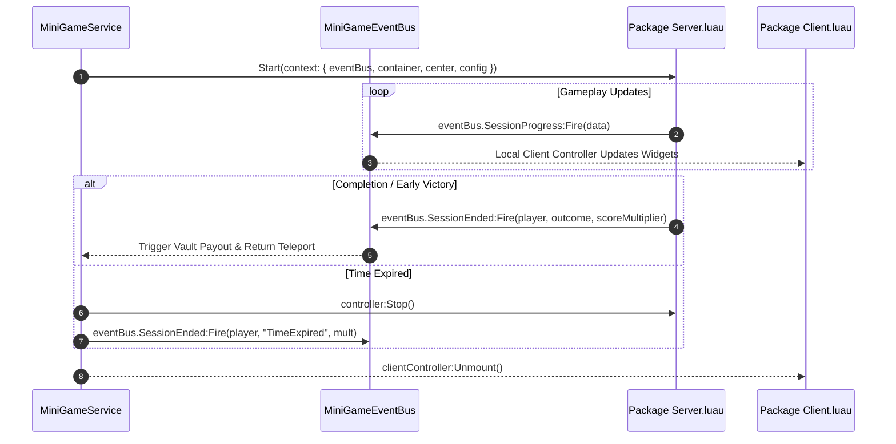

# Decoupled Mini-Game Architecture & Universe-Ready Packages

This document specifies the decoupled architecture for mini-games in the Arena Coin Battle project. The architecture enables mini-games to scale as independent experiences that can run either **embedded** inside the main game's Sky Sub-Arena ($Y=400$) or **standalone** as dedicated places within a multi-place Roblox Universe, without impacting or modifying the central arena codebase.

---

## 🏛️ Core Decoupling Principles

```
+---------------------------------------------------------------------------------------+
|                                    CENTRAL ARENA                                      |
|   CoinCollector.server.lua  <--->  VaultService.lua  <--->  PlayerBase.luau           |
+---------------------------------------------------------------------------------------+
                                           |
                                  [Pure Interface Boundary]
                                           v
+---------------------------------------------------------------------------------------+
|                                  MINI-GAME CORE SHELL                                 |
|                                                                                       |
|   ReplicatedStorage:                          ServerScriptService:                    |
|   - MiniGameRegistry.luau                     - MiniGameService.lua                   |
|   - MiniGameEventBus.luau                     (Zero hardcoded game IDs)               |
+---------------------------------------------------------------------------------------+
                                           |
                              [Dynamic Package Discovery]
                                           v
+---------------------------------------------------------------------------------------+
|                           INDEPENDENT MINI-GAME PACKAGES                              |
|                                                                                       |
|   ReplicatedStorage/MiniGames/Packages/<GameId>/                                     |
|   ├── Config.luau       (Pure tuning, place ID, mode, duration, rewards, buff)       |
|   └── Client.luau       (Autonomous client controller: custom widgets, animations)   |
|                                                                                       |
|   ServerScriptService/MiniGames/Packages/<GameId>/                                   |
|   └── Server.luau       (Autonomous server engine: spawns, logic, reward emitter)    |
+---------------------------------------------------------------------------------------+
```

### 1. Zero-Coupling Rule
Adding, modifying, or deleting a mini-game requires **zero modifications** to:
- `src/ServerScriptService/CoinCollector.server.lua`
- `src/ServerScriptService/MiniGames/MiniGameService.lua`
- `src/StarterPlayer/StarterPlayerScripts/MiniGameHUD.client.lua`
- `src/ReplicatedStorage/PlayerBase.luau`

### 2. Autonomous Package Layout
Each mini-game is isolated within dedicated package folders:
- **Shared / Client**: `src/ReplicatedStorage/MiniGames/Packages/<GameId>/`
  - `Config.luau`: Pure configuration, execution mode, standalone place ID, duration, reward bounds, and buff definition.
  - `Client.luau`: Dynamic client controller implementing `:Mount(context)` and `:Unmount()`. Mounts custom HUD widgets, particle triggers, and local sound effects.
- **Server**: `src/ServerScriptService/MiniGames/Packages/<GameId>/`
  - `Server.luau`: Autonomous server engine implementing `Start(context)` and `:Stop()`.

---

## 📡 In-Process Event Bus & Network Bridge

Communication between the core host and mini-game packages flows through `MiniGameEventBus`:



### Event Bus Signals (`MiniGameEventBus.luau`)
| Signal | Signature | Description |
| :--- | :--- | :--- |
| `SessionStarted` | `(player: Player, context: table)` | Broadcast when a session initializes. |
| `SessionProgress` | `(player: Player, progressData: table)` | Streams live objective, score, and custom progress values. |
| `SessionEnded` | `(player: Player, outcome: string, multiplier: number)` | Signals round conclusion and triggers reward distribution. |
| `ClientMounted` | `(gameId: string, container: Instance)` | Fires when custom package UI mounts. |
| `ClientUnmounted` | `(gameId: string)` | Fires when custom package UI unmounts. |

---

## 🌐 Universe-Ready Execution Modes

Every mini-game defines an execution mode in its `Config.luau`:

```luau
mode = "Embedded" | "Universe" | "Hybrid"
placeId = 0 -- Target Roblox Place ID in Universe
```

### 1. Mode `"Embedded"`
- Runs within the main experience place.
- `MiniGameService` procedurally generates an isolated $54 \times 54$ diamond-plate sky platform at $Y=400$ vertically aligned with the player's base compound.
- Forcefield perimeter walls and a server bounds-watcher ($Y < 370$) ensure absolute safety from void falls.
- Teardown completely wipes the platform model from `Workspace`.

### 2. Mode `"Universe"`
- Runs as an independent Roblox Place within a multi-place Universe.
- `MiniGameService` initiates `TeleportService:TeleportAsync(gameDef.placeId, { player }, teleportOptions)`.
- Teleport data securely transfers `userId`, `baseId`, `gameId`, and `sourcePlaceId`.
- **Studio Fallback**: If tested in Roblox Studio or if `placeId <= 0`, `MiniGameService` automatically degrades to `"Embedded"` mode so developers can playtest immediately without multi-place publishing.

### 3. Mode `"Hybrid"` (Default)
- Supports both embedded sky sub-arena play and standalone place execution using the exact same codebase.

---

## 🚀 Standalone Place Bootstrap Template

To run any mini-game package as a dedicated standalone Roblox place in your universe, create a `Script` in `ServerScriptService` named `StandaloneRunner.server.luau`:

```luau
--[[
    StandaloneRunner.server.luau
    Paste this script into ServerScriptService of a dedicated standalone mini-game place.
]]

local Players = game:GetService("Players")
local ReplicatedStorage = game:GetService("ReplicatedStorage")
local TeleportService = game:GetService("TeleportService")

-- 1. Configuration: specify which mini-game this place runs
local TARGET_GAME_ID = "CoinForge" -- or "BaseSentry"

local MiniGameRegistry = require(ReplicatedStorage.MiniGames.MiniGameRegistry)
local MiniGameEventBus = require(ReplicatedStorage.MiniGames.MiniGameEventBus)
local gameConfig = MiniGameRegistry.GetGame(TARGET_GAME_ID)

-- 2. Locate Package Server Engine
local packagesFolder = ReplicatedStorage.MiniGames.Packages
local targetPackage = packagesFolder:FindFirstChild(TARGET_GAME_ID)
local ServerEngine = require(game.ServerScriptService.MiniGames.Packages[TARGET_GAME_ID].Server)

-- 3. Player Join & Session Launch
Players.PlayerAdded:Connect(function(player)
    player.CharacterAdded:Connect(function(character)
        task.wait(0.5)

        -- Retrieve teleport data if arriving from central arena
        local joinData = player:GetJoinData()
        local teleportData = joinData and joinData.TeleportData or {}
        local returnPlaceId = teleportData.sourcePlaceId or 0

        -- Launch the standalone mini-game session
        local context = {
            player = player,
            container = workspace,
            center = Vector3.new(0, 0, 0),
            duration = gameConfig.duration or 60,
            config = gameConfig,
            eventBus = MiniGameEventBus,
            isStandalone = true,
            onProgress = function(data)
                MiniGameEventBus.SessionProgress:Fire(data)
            end,
            onComplete = function(outcome, scoreMultiplier)
                print(string.format("Game Over: %s (Mult: %.2f)", outcome, scoreMultiplier))
                
                -- Teleport player back to central arena with reward payload
                if returnPlaceId > 0 then
                    local returnOptions = Instance.new("TeleportOptions")
                    returnOptions:SetTeleportData({
                        gameId = TARGET_GAME_ID,
                        outcome = outcome,
                        scoreMultiplier = scoreMultiplier,
                    })
                    TeleportService:TeleportAsync(returnPlaceId, { player }, returnOptions)
                end
            end,
        }

        ServerEngine.Start(context)
    end)
end)
```

---

## 📦 How to Add a New Mini-Game in 3 Steps

### Step 1: Create Shared Package
Create `src/ReplicatedStorage/MiniGames/Packages/<YourGame>/`:
- `Config.luau`: Set `id`, `displayName`, `duration`, `mode = "Hybrid"`, `rewards`, and `buff`.
- `Client.luau`: Return table with `:Mount(context)` and `:Unmount()`.

### Step 2: Create Server Engine
Create `src/ServerScriptService/MiniGames/Packages/<YourGame>/Server.luau`:
- Return table with `.Start(context)` and `:Stop()`.

### Step 3: Register in Catalog
Open [src/ReplicatedStorage/MiniGames/MiniGameRegistry.luau](src/ReplicatedStorage/MiniGames/MiniGameRegistry.luau) and call `MiniGameRegistry.RegisterGame({...})`.

**Done!** `MiniGameService` and `MiniGameHUD` will dynamically discover, present, mount, and clean up your new mini-game automatically with zero edits to core arena scripts.
