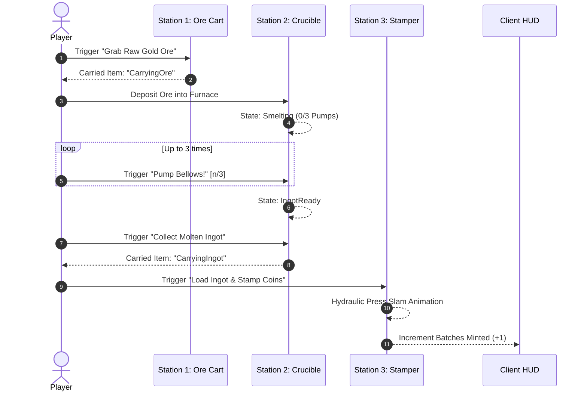

# Coin Forge Mini-Game Specification

A fast-paced micro-tycoon mini-game staged in the Sky Sub-Arena where players mine raw gold ore, smelt hot ingots using manually pumped bellows, and stamp out minted coin batches against a 60-second timer.

---

## 📋 Game Metadata

| Field | Value |
| :--- | :--- |
| **Identifier** | `CoinForge` |
| **Display Name** | Coin Forge |
| **Category** | Micro-Tycoon |
| **Icon** | 🔥 |
| **Duration** | 60 seconds |
| **Order Index** | 1 |
| **Source Implementation** | [src/ServerScriptService/MiniGames/Games/CoinForge.lua](src/ServerScriptService/MiniGames/Games/CoinForge.lua) |
| **Catalog Registration** | [src/ReplicatedStorage/MiniGames/MiniGameRegistry.luau](src/ReplicatedStorage/MiniGames/MiniGameRegistry.luau) |

---

## ⚙️ Gameplay Mechanics & Station Layout

The sub-arena is configured with three specialized industrial production stations arranged linearly across the platform:

```
+-----------------------------------------------------------------------+
|                         Sky Sub-Arena Floor                           |
|                                                                       |
|   [Station 1: Ore Cart]     [Station 2: Crucible]     [Station 3:     |
|    (-14, 2.5, 0)             (0, 3.5, 6)               Stamper]       |
|    - Raw Gold Ore             - Smelting Core           (14, 2, 0)    |
|    - Instant Pickup           - 3x Bellows Pump         - Hydraulic   |
|                               - Molten Ingot Ready        Coin Press  |
|                                                                       |
|                       [Status Billboard: Y=10]                        |
|                     CARRIER: Molten Ingot / Ore                       |
|                       Batches Minted Counter                          |
|                                                                       |
|                          [Spawn Pad: +Z]                              |
+-----------------------------------------------------------------------+
```

### Station 1: Ore Cart Hopper (Left)
- **Position**: Offset $(-14, 2.5, 0)$ from platform center.
- **Visuals**: Dark metal container (`Color3.fromRGB(55, 60, 68)`) filled with illuminated golden ore (`Color3.fromRGB(241, 196, 15)`) emitting a warm point light.
- **Interaction**: ProximityPrompt `"Grab Raw Gold Ore"`. Available only when player is empty-handed (`carriedItem == "None"`).
- **Result**: Sets player carried item to `"CarryingOre"`.

### Station 2: Smelting Crucible & Bellows (Center)
- **Position**: Offset $(0, 3.5, 6)$ from platform center.
- **Visuals**: Heavy stone cobblestone furnace with an emissive neon heating core and dynamic fire lighting.
- **State Machine**:
  1. **Empty**: Accepts raw gold ore (`ActionText = "Deposit Ore into Furnace"`).
  2. **Smelting**: Crucible begins smelting. Automatically finishes after 5 seconds if left alone, or can be rapidly accelerated by manually pumping the bellows.
  3. **Bellows Pumping**: Each trigger increments `smeltPumps` by 1 and flashes furnace brightness to 1.4. Once $3$ pumps are reached (`maxSmeltPumps = 3`), the ingot instantly reaches molten status.
  4. **Ingot Ready**: Heating core glows bright golden-white (`Color3.fromRGB(255, 220, 80)`). Prompt changes to `"Collect Molten Ingot"`, granting `"CarryingIngot"`.

### Station 3: Hydraulic Coin Stamper (Right)
- **Position**: Offset $(14, 2, 0)$ from platform center.
- **Visuals**: Heavy diamond-plate pedestal supporting a steel anvil and an overhead hydraulic press head.
- **Interaction**: ProximityPrompt `"Load Ingot & Stamp Coins"`. Requires `"CarryingIngot"`.
- **Result**:
  - Head animates down $1.8$ studs onto the anvil with a flash of light.
  - Returns to rest position after $0.25$ seconds.
  - Consumes the ingot and increments `batchesStamped` by 1.
  - Streams updated score to the HUD.

---

## 🔁 Complete Interaction Loop



---

## 💰 Rewards & Arena Buffs

### Reward Payout Table
| Reward Item | Base Quantity | Multiplier Scaling | Drop Chance |
| :--- | :--- | :--- | :--- |
| **Coins** | 40 – 80 | Scaled by batches minted ($\text{batches} \times 0.25$, clamped $0.25 - 2.0$) | 100% |
| **Gems** | 1 – 2 | Scaled by batches minted | 100% |
| **Ancient Relic** | 1 | Unscaled flat roll | 20% (`relicChance = 0.20`) |
| **Star Fragment** | 1 | Unscaled flat roll | 5% (`fragmentChance = 0.05`) |

### Next-Run Arena Buff: "Forgemaster's Focus"
- **Buff ID**: `CoinForge_MultiplierBuff`
- **Buff Type**: `MultiplierBonus`
- **Bonus Value**: $+0.20$ ($+20\%$)
- **Effect**: Increases all coin and gem collection values gathered during the player's next Central Arena run by $+0.20\times$. Automatically stored in `VaultService` and consumed upon entering the arena gates.

---

## 🔧 Tuning Parameters & Maintenance Tips

All gameplay constants are exposed in [src/ServerScriptService/MiniGames/Games/CoinForge.lua](src/ServerScriptService/MiniGames/Games/CoinForge.lua) and [src/ReplicatedStorage/MiniGames/MiniGameRegistry.luau](src/ReplicatedStorage/MiniGames/MiniGameRegistry.luau) for tuning:

| Parameter | Location | Default | Impact |
| :--- | :--- | :--- | :--- |
| `duration` | [src/ReplicatedStorage/MiniGames/MiniGameRegistry.luau](src/ReplicatedStorage/MiniGames/MiniGameRegistry.luau) | `60` | Total time limit in seconds. |
| `maxSmeltPumps` | [src/ServerScriptService/MiniGames/Games/CoinForge.lua](src/ServerScriptService/MiniGames/Games/CoinForge.lua) | `3` | Number of bellows pumps required to immediately smelt an ingot. |
| `autoSmeltTime` | [src/ServerScriptService/MiniGames/Games/CoinForge.lua](src/ServerScriptService/MiniGames/Games/CoinForge.lua) | `5.0s` | Time required to passively smelt without bellows pumping. |
| `stamperSlamDuration` | [src/ServerScriptService/MiniGames/Games/CoinForge.lua](src/ServerScriptService/MiniGames/Games/CoinForge.lua) | `0.25s` | Duration of the hydraulic stamper press animation cycle. |
| `relicChance` | [src/ReplicatedStorage/MiniGames/MiniGameRegistry.luau](src/ReplicatedStorage/MiniGames/MiniGameRegistry.luau) | `0.20` | Probability of receiving an Ancient Relic upon completion. |
| `fragmentChance` | [src/ReplicatedStorage/MiniGames/MiniGameRegistry.luau](src/ReplicatedStorage/MiniGames/MiniGameRegistry.luau) | `0.05` | Probability of receiving a Star Fragment upon completion. |

### Maintenance & Debugging Tips
1. **Prompt Desync Prevention**: `CoinForge:UpdateStatus()` is invoked after every interaction to enforce single-item carry limits and toggle ProximityPrompt visibility. Never bypass `UpdateStatus()` when adding new station steps.
2. **Platform Teardown**: All instances reside in `gameContentFolder`. When the session concludes, `CoinForge:Stop()` disconnects active connections, ensuring zero dangling threads or memory leaks.
