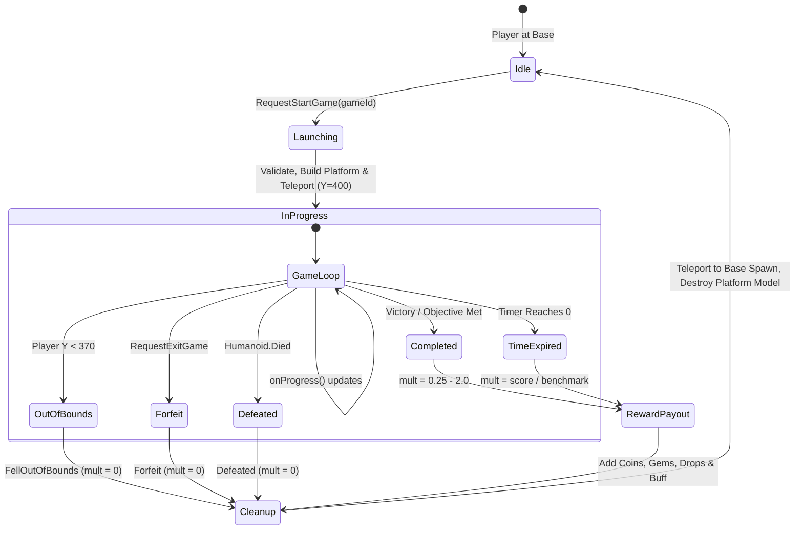

# Sky Sub-Arena Mini-Games System

The Sky Sub-Arena subsystem provides isolated, vertical gameplay experiences high above the main compounds at $Y=400$. Players enter specialized challenge arenas during downtime between Central Arena runs to earn bonus currency, rare vault items, and powerful temporary buffs for their subsequent Central Arena runs.

---

## 🏗️ Architecture Overview

```
                      +----------------------------------+
                      |      Sky Sub-Arena (Y = 400)      |
                      |   [54x54 Stud Platform, Forcefield|
                      |    Perimeter Walls, Content Model]|
                      +-----------------+----------------+
                                        ^
                              Teleport  |  Return Teleport
                              on Start  |  on Completion/Exit
                                        v
+---------------------------------------+---------------------------------------+
|  Cardinal Base Compound (Ground Level, Y = 0 to 4, X/Z = +/-140 Studs)        |
|  - Mini-Game Terminal / Portal Pad                                            |
|  - Currency Bank Vault                                                        |
|  - Base Claim Pad & Spawn Location                                            |
+-------------------------------------------------------------------------------+
```

### 1. Vertical Isolation ($Y = 400$)
- **Spatial Decoupling**: Each sub-arena platform is procedurally generated at elevation $Y = 400$, directly vertically aligned with the player's cardinal base compound $(X, Z)$.
- **Zero Collision Interference**: Physical structures, NPCs, and projectile entities at $Y=400$ do not interact with ground-level base compounds or the central arena.
- **Safety Perimeter**: Each platform measures $54 \times 54$ studs with 16-stud tall translucent forcefield walls (`ForceField` material, 0.65 transparency) to prevent falling off.

### 2. Mutual Exclusion with Central Arena
Mini-game sessions and Central Arena runs are strictly mutually exclusive:
- **Central Arena Priority**: If a player is currently in an active Central Arena run, they cannot launch a mini-game.
- **Sub-Arena Lockout**: While a player is active in a Sky Sub-Arena session, they cannot trigger the Central Arena activation pad or enter the sliding gates.
- **Single Active Session**: A player can only participate in one mini-game session at any given time.

---

## 🔄 Session Lifecycle State Machine



### State Transitions
1. **Request & Validation (`MiniGameService.StartSession`)**:
   - Player triggers the mini-game interface from their base.
   - Server verifies: player not already in a mini-game, player not in the Central Arena, game ID is valid and enabled.
2. **Setup & Teleport**:
   - Procedural sky platform generated at base $(X, Z)$ with $Y = 400$.
   - Dedicated `GameContent` folder populated.
   - Character safely teleported to the sky platform spawn pad with velocity zeroed.
   - Controller instantiated (`Start(options)`).
3. **Active Loop**:
   - Real-time countdown timer runs on the server.
   - Status updates streamed to client HUD via `GameStateUpdate` remote.
   - Continuous bounds-checking monitors player altitude ($Y \ge 370$).
4. **Termination Triggers**:
   - **Victory / Objective Complete**: Controller invokes `onComplete("Victory"|"Completed", scoreMultiplier)`.
   - **Time Expired**: Countdown reaches 0 seconds.
   - **Forfeit**: Client fires `RequestExitGame` remote.
   - **Player Defeat**: `Humanoid.Died` event fires.
   - **Bounds Violation**: Fallback watcher detects $Y < 370$ studs.
   - **Disconnection**: `Players.PlayerRemoving` cleans up active sessions.
5. **Teardown & Return**:
   - Controller stopped via `controller:Stop()` to disconnect Heartbeat/RenderStepped connections and destroy spawned NPCs.
   - Character safely teleported back to base spawn point.
   - Sky platform model deleted after a 0.5s grace period.

---

## 💎 Hybrid Reward Model

Every successful mini-game session awards rewards across three distinct categories:

### 1. Instant Currencies
- **Coins**: Distributed directly into player's wallet or vault according to game performance:
  $$\text{Coins Earned} = \text{round}(\text{random}(\text{minCoins}, \text{maxCoins}) \times \text{clamp}(\text{multiplier}, 0.25, 2.0))$$
- **Gems**: High-value radiant gems awarded with decimal precision rounded to tenths:
  $$\text{Gems Earned} = \text{round}(\text{random}(\text{minGems}, \text{maxGems}) \times \text{multiplier} \times 10) / 10$$

### 2. Rare Vault Item Drops
Guaranteed independent percentage rolls upon victory/completion:
- **Ancient Relic**: Rare artifact used in endgame base vault upgrades.
- **Star Fragment**: Mythic crystal component used for high-tier economy multipliers.

### 3. Next-Run Central Arena Buffs
Completing a mini-game grants a single-use temporary enhancement that automatically activates on the player's **next Central Arena run**:
- **Multiplier Bonus (`MultiplierBonus`)**: Adds $+0.20\times$ collection multiplier to all coins and gems gathered in the central arena.
- **Time Extension (`TimeBonus`)**: Adds $+5$ seconds of extra run time to the central arena countdown timer before ejection.
- Buffs are tracked persistently in `VaultService` and consumed upon entering the arena.

---

## 📖 Subsystem Documentation Links

Explore the dedicated documentation for individual mini-games and the extension guide:

- [ARCHITECTURE.md](ARCHITECTURE.md): Complete architecture manual for decoupled packages, event bus signals, and universe-ready standalone place execution.
- [COIN_FORGE.md](COIN_FORGE.md): Complete mechanical and operational guide for the Coin Forge micro-tycoon mini-game.
- [BASE_SENTRY.md](BASE_SENTRY.md): Wave design, sentry mechanics, and stats for the Base Sentry tower defense mini-game.
- [NEW_MINIGAME_GUIDE.md](NEW_MINIGAME_GUIDE.md): Step-by-step developer guide and boilerplate template for authoring new mini-games.
